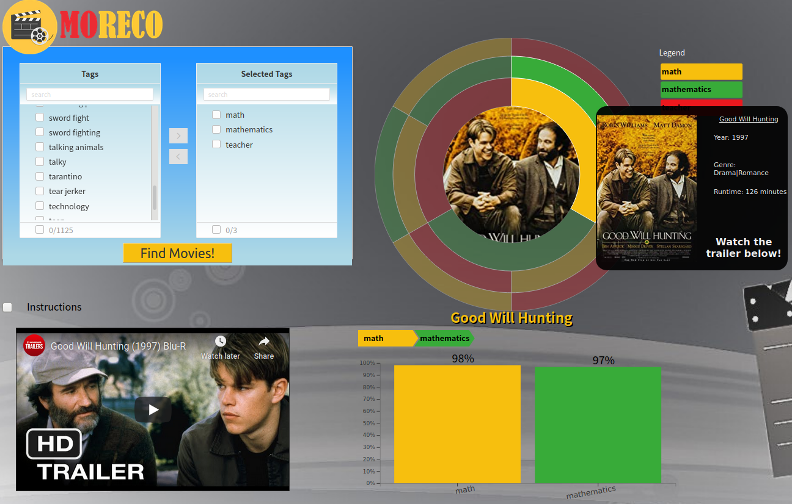

# moreco
Data &amp; Visual Analytics Group Project

# Description

This project presents a novel interface for a reccomendation engine.  The goal was to provide users with a better understanding behind the rationale for the recomendations.  It also encourages users to explore recommendations which aren't necessarily the  top filtered results as in most systems. 

# Data Sources

Data sets were obtained from the following sources:

* IMDB Title- [Basics](https://datasets.imdbws.com/) [info](https://www.imdb.com/interfaces/)
* IMDB Ratings- [Ratings](https://datasets.imdbws.com/)  [info](https://www.imdb.com/interfaces/)
* IMDB Cast/Crew - [Principals](https://datasets.imdbws.com/) [info](https://www.imdb.com/interfaces/)
* IMDB Director/Writer - [Crew](https://datasets.imdbws.com/) [info](https://www.imdb.com/interfaces/)
* GroupLens - [MovieLens 25M](https://grouplens.org/datasets/movielens/) [info](http://files.grouplens.org/datasets/movielens/ml-25m-README.html)

Data was also collect from the following sites:

* [Youtube](youtube.com)
* [Intertnet Movie DataBase (IMDB)](https://www.imdb.com)

# Database Schema

| TABLE | COLUMN(S) (DATATYPE) |
| --- |:--- |
| tags | id (integer), name (text) |
| movies | id (integer), kind (text), primary_title (text), original_ttitle (text), release_year (integer), runtime_minutes (integer), genres (text) |
| scores | fk_id (text), tag_id_1 (real), tag_id_2 (real), ... tag_id_n (real) |
| directors | id (text), name (text) |
| trailers | id (text), yt_video_id (text) |
| posters | id (text), img_url (text) |
| movie_meta | [d (text), year (text), genres (text), title (text), runtime_minutes (text) |

# Raw Dataset Schema

| DATA SET NAME | COLUMN(S) |
| --- |:--- |
| genome_scores | movieId, tagId, relevance |
| genome_tags | tagId, tag |
| links | movieId, imdbId, tmdbId |
| movies | movieId, title, genres |
| ratings | userId, movieId, rating, timestamp |
| tags | userId, movieId, tag, timestamp |
| imdb_name_basics | nconst, primaryName, birthYear, deathYear, primaryProfession, knownForTitles |
| imdb_title_basics | tconst, titleType, primaryTitle, originalTitle, isAdult, startYear, endYear, runtimeMinutes, genres |
| imdb_ratings | tconst, averageRating, numVotes |
| imdb_crew | tconst, directors, writers |
| imdb_principals | tconst, ordering, nconst, category, job, characters |
	
# How to Run

## _Automatic_

The manual steps have been added to a script for convenience.  The database will be downloaded as part of this script.  Downloading will be skipped if it already exists.  Note that this doesn't detect database changes so you will need to manually download it if you don't have the latest database.

1. Run `python run_local.py`

## _Manual_

1. Download the `movie_sqlite.db` database from the [releases](https://github.com/cwipy7/moreco/releases) in the repo.

2. Place downloaded databse in the `db` directory.

3. Navigate to `moreco` dir.

4. Install the python library dependencies using `pip install -r requirements.txt`.

5. Navigate to the `visual` dir.

6. Start the server with `python server.py`

7. Open web browser to the link posted.

	
# Technologies Used

 <a href="https://www.python.org/"></img></a>
 <a href="https://flask.palletsprojects.com/en/1.1.x/"></img></a>
<a href="https://www.heroku.com"></img></a>
<a href="https://scikit-learn.org/stable/"></img></a>
<a href="https://numpy.org/"></img></a>
<a href="https://pandas.pydata.org/"></img></a>
<a href="https://www.postgresql.org/"></img></a>
<a href="https://github.com/"></img></a>
<a href="https://d3js.org/"></img></a>
<a href="https://products.office.com/en-us/excel"></img></a>
<a href="https://en.wikipedia.org/wiki/Microsoft\_Paint"></img></a>
<a href="https://products.office.com/en-us/word"></img></a>
<a href="https://www.google.com/docs/about/"></img></a>
<a href="https://www.spyder-ide.org/"></img></a>
<a href="https://www.jetbrains.com/pycharm/"></img></a>
<a href="http://www.sublimetext.com/"></img></a>
<a href="https://www.sqlite.org/index.html"></img></a>
 <a href="https://www.r-project.org/"></img></a>
<a href="https://openrefine.org/"></img></a>
<a href="https://www.slack.com/"></img></a>

# Improvements
 
## Features
 
 * Tag weights: we currently have a pre-determined set of weights for the tags depending on their order in the permutation.  To provide a more personalized experience we could allow the user to control these individual weights.  A simple slider next to each tag would be sufficient to enable this feature.
 * Expand the site to include directors/actors as entities which could be recommended.
  
## Fixes / Cleanup
 
 * Database: optimizations by indexing columns, normalization of the data, proper column data type usage.
 * Add links for each recommendation to be able to go to the IMDB website.
 * Processing: improve the way we make predictions to speed up calculations and allow more tags to be selected.
 * Data sources: consolidate the data sources which are used for the app (currently a csv and database are being used).
 * Data: clean the tag data set to remove duplicates.  Many of our tags are highly correlated and represent the same concept.  For example: sci fi, sci-fi, science fiction, scifi.  We can safely assume these all represent the same underlying feature and thus we should reduce them down to a single entity.  Prior to doing so, some basic analysis should be done to validate that these are highly correlated throughout the dataset.
 
 
 